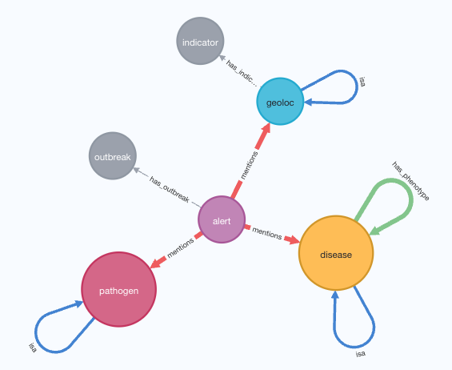

Knowledge graph and ontology for disease outbreak scenarios
===========================================================

This project implements a knowledge graph framework for representing
disease outbreak scenarios. The knowledge graph is built by
processing disease outbreak alerts from ProMED and other sources and
combines this with ontological information to create a structured 
representation of outbreak events.

Sources
-------

The KG builds on the following sources:
- Outbreak alerts: text from outbreak alerts are processed and
terms representing diseases/phenotypes/pathogens/symptoms/geolocations
are automatically extracted using the Gilda system. This produces `mentioned_in` relationships.
- Individual alerts are grouped by the inferred outbreak that they belong to, represented
as a `has_outbreak` relationship.
- Taxonomy of diseases: extracted from the Medical Subject Headings tree structure
- Taxonomy of pathogens: extracted from the Medical Subject Headings tree structure
- Taxonomy of geolocations: extracted from the Medical Subject Headings tree structure
- Pathogen-disease relations: relationships representing the fact that a pathogen causes a disease
are represented as `has_pathogen` relationships.
- Disease-phenotype/symptom relations: relationships representing the fact that a disease
causes a phenotype/symptom are represented as `has_phenotype` relationships.
- Development/health indicators: extracted from WDI data, geolocations are
linked to indicators with the `has_indicator` relationship.

Knowledge graph
---------------

The knowledge graph is represented as a set of nodes and edges. Nodes
represent entities such as diseases, pathogens, geolocations, and
phenotypes. Edges represent relationships between these entities.
The knowledge graph is deployed in a Neo4j database.

Interaction
-----------

The knowledge graph can be queried using the Cypher query language
directly through Neo4j. The repository also provides a Python client
and a REST API for querying the knowledge graph. The graph database
and the surrounding REST API are Dockerized and deployed on AWS.

Funding
-------

This work was supported by [CAPTRS](https://captrs.org/).